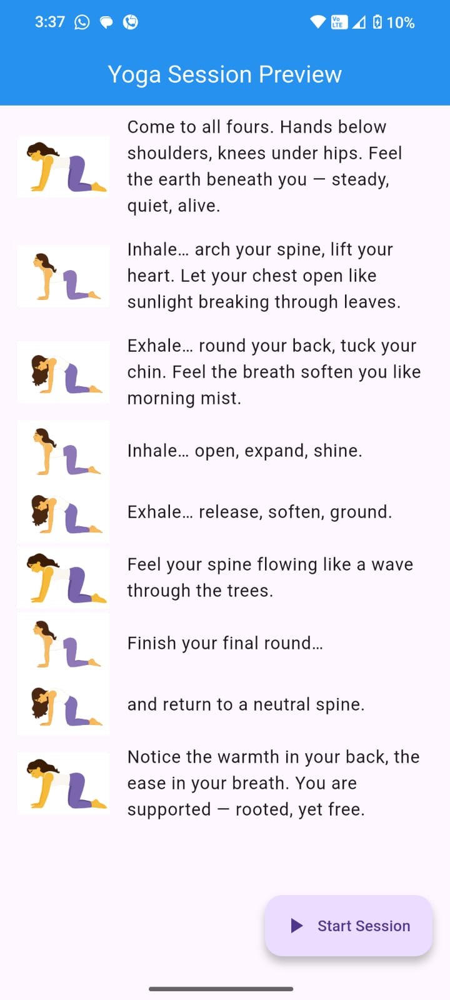
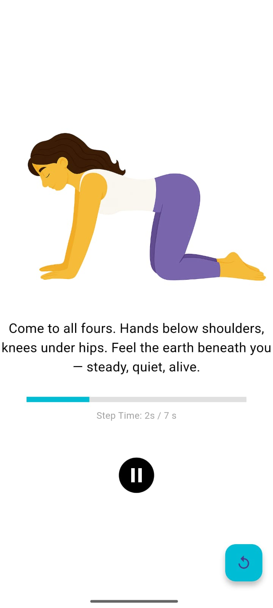
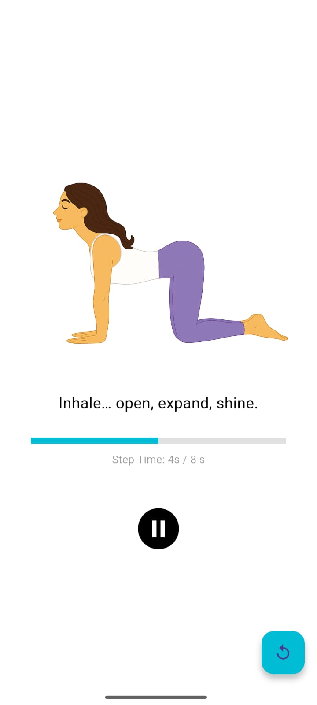

# 🧘‍♀️ Modular Cat-Cow Yoga App (Flutter)

This app simulates a guided yoga session using synchronized audio, images, and pose metadata, just like a smart yoga mat experience. It's modular, meaning you can add new poses via JSON and media without changing the code.


---

## 📱 Features

- ⏯ Play / Pause / Resume the yoga session
- 📶 Pose-level progress bar with step timers
- 🔁 Dynamic pose loading from JSON
- 🔃 Restart entire session anytime
- 👀 Preview all poses before session begins

---


## 🧰 Tech Stack

- **Flutter** (SDK 3.8.0)
- **Dart**
- **Provider** (for state management)
- **audioplayers** (for media playback)


---

## 📂 Folder Structure
```
lib/
  ├── main.dart
  ├── model/
  │     └── yoga_sequence.dart
  ├── providers/
  │     └── session_provider.dart
  ├── screens/
  │     ├── pose_preview_screen.dart
  │     └── session_player.dart
  ├── services/
        └── json_loader.dart


assets/
  ├── audio/
  │     ├── cat_cow_intro.mp3
  │     ├── cat_cow_loop.mp3
  │     ├── cat_cow_outro.mp3
  │     └── bg_music.mp3
  ├── images/
  │     ├── Base.png
  │     ├── Cat.png
  │     └── Cow.png
  └── poses.json
```

## 🚀 How to Run Locally

### 1. Clone this repo
```bash
git clone https://github.com/yourname/cat-cow-yoga.git
cd cat-cow-yoga
```

### 2. Install dependencies
```bash
flutter pub get
```

### 3. Run on your device or emulator
```bash
flutter run
```
---

## 📄 poses.json Format (Sample)
```json
{
  "metadata": {
    "title": "Cat-Cow Flow",
    "defaultLoopCount": 4
  },
  "assets": {
    "images": {
      "base": "Base.png",
      "cat": "Cat.png",
      "cow": "Cow.png"
    },
    "audio": {
      "intro": "cat_cow_intro.mp3",
      "loop": "cat_cow_loop.mp3",
      "outro": "cat_cow_outro.mp3"
    }
  },
  "sequence": [
    {
      "type": "segment",
      "name": "intro",
      "audioRef": "intro",
      "durationSec": 23,
      "script": [
        {
          "text": "Come to all fours...",
          "startSec": 0,
          "endSec": 7,
          "imageRef": "base"
        },
        {
          "text": "Inhale… arch your spine...",
          "startSec": 7,
          "endSec": 14,
          "imageRef": "cat"
        }
      ]
    }
  ]
}
```

---


| Pose Preview                             | In-Session                            | Session                                |
|------------------------------------------|---------------------------------------|----------------------------------------|
|  |  |  |


> All assets are locally stored and loaded via the asset bundle.
## 📧 Contact
For any questions or feedback: `7061rajaryan@gmail.com`

---

Happy coding & stretching! 🙏
